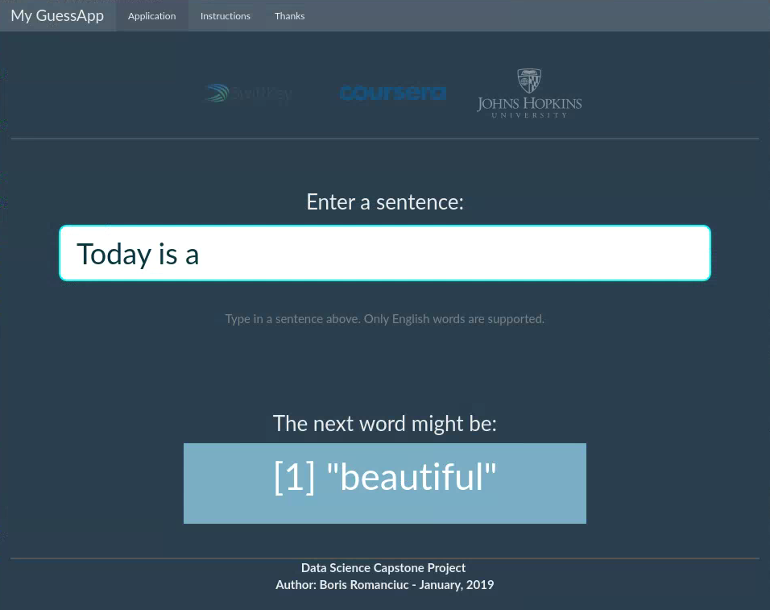

My GuessApp application
========================================================
font-import: https://fonts.googleapis.com/css?family=Open+Sans
font-family: 'Open Sans'
transition: rotate
css:style.css

Text prediction shiny application created for

    Coursera-Johns Hopkins University 
      Data Science Specialization
      Switftkey Capstone Project 
      
Author: Boris Romanciuc

Date: January 14th, 2019

Text Prediction Application
========================================================
The aim of this Shiny application is to predict the next word to type in a sentence that user already typed. 

The application is done to present the Natural Language Processing model created during the Data Science Captone Project Course.

The algorithm of the application is based on a N-Gram model that was built from
a large corpora text data supplied by SwiftKey company. 

The material was sourced from Twitter, News and Blogs. This course was developed by the John Hopkins University, available in Coursera.

Shiny GuessApp Interface
========================================================
My GuessApp uses a simple and a clean user interface (UI) which
access the data files for predicitons algorithm that is working
in the background.

The user enters some word into the input box and the next word to be 
predicted is presented in the below box. 

Algorithm behind the app
========================================================
### Natural Language Processing Model

- The word to be predicted, is by using the frequency combinations of two, three and four words.

- The frequency of combintations is calculated using the corpora texts extracted from blogs, news and twitter that SwiftKey offers for this projects.

- The original data has 2.5Millons of lines and 550MB. For this application it was selected 5% of random lines to create the frequency tables with the up-mentioned combinations. The summary size of these tables is around 3MB. 

- The word 'a' is used when there is no hint for guessing or no pattern is found. 

Try My GuessApp Today
========================================================
## Shiny application

- The shiny application is available in  
https://boris-13.shinyapps.io/guess_shinyapp/

- You can also download it from github repository 
https://github.com/boris-13/capstone_data_science

